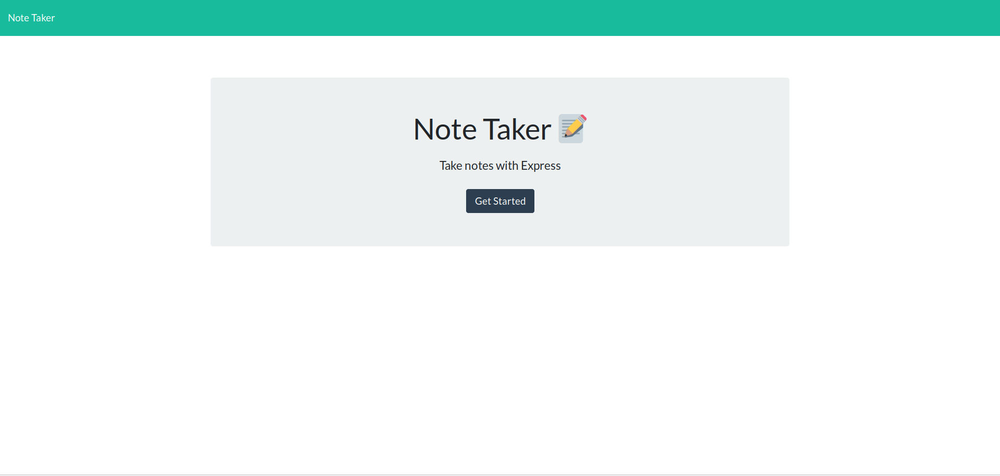
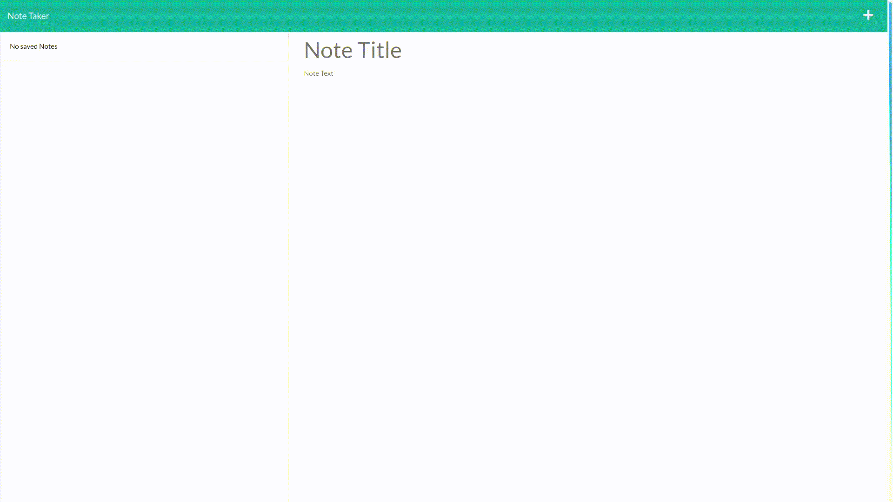

# Note Taker [](https://opensource.org/licenses/MIT)

## Description
This is an application that allows a user to take notes. The user can also save and delete the notes. This application runs on NodeJS and uses Express for the server. It originally only had a front end and needed a back end built. [The application can be accessed here.](https://gentle-reaches-16409.herokuapp.com/)



## Table of Contents
* [Installation](#installation)
* [Usage](#usage)
* [License](#license)
* [Contribution](#contribution)
* [Tests](#tests)
* [Questions](#questions)

## Installation 
The application can be installed by cloning the repository after you have installed node.js. It can then be run by opening the folder it was cloned to and running the command ```node server.js```.

## Usage 
It is used by opening the website. After that you can take notes by entering a title with text then clicking the save button in the upper right corner. You can click the plus to add a new note and the trash next to the note to delete a note.



## License 
Copyright zachary-berdell-elliott

Permission is hereby granted, free of charge, to any person obtaining a copy of this software and associated documentation files (the “Software”), to deal in the Software without restriction, including without limitation the rights to use, copy, modify, merge, publish, distribute, sublicense, and/or sell copies of the Software, and to permit persons to whom the Software is furnished to do so, subject to the following conditions:

  The above copyright notice and this permission notice shall be included in all copies or substantial portions of the Software.
    
  THE SOFTWARE IS PROVIDED “AS IS”, WITHOUT WARRANTY OF ANY KIND, EXPRESS OR IMPLIED, INCLUDING BUT NOT LIMITED TO THE WARRANTIES OF MERCHANTABILITY, FITNESS FOR A PARTICULAR PURPOSE AND NONINFRINGEMENT. IN NO EVENT SHALL THE AUTHORS OR COPYRIGHT HOLDERS BE LIABLE FOR ANY CLAIM, DAMAGES OR OTHER LIABILITY, WHETHER IN AN ACTION OF CONTRACT, TORT OR OTHERWISE, ARISING FROM, OUT OF OR IN CONNECTION WITH THE SOFTWARE OR THE USE OR OTHER DEALINGS IN THE SOFTWARE.

## Contribution 
This application can be contributed to by reaching out to me to report bugs or asking for contribution permissions.

## Tests 
This application can be tested by starting the server then seeing if there are any issues.

## Questions 
FAQ: 

One question that gets asked is where can the server be accessed if it is run locally? It can be accessed at [localhost:3000](localhost:3000) when it is being run locally.

If you have any additional questions, please contact me at zacharyberdell@gmail.com to receive an answer to your question. If you would like to view other projects by me then [visit my profile here.](https://github.com/zachary-berdell-elliott)
